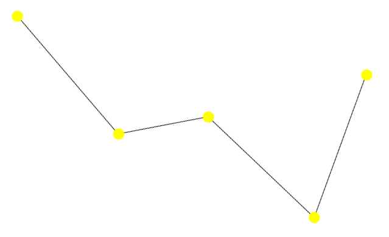

# Detection of malicious domains via a large scale network analysis
This is my master thesis written jointly at [Department of Mathematics and Its Applications](https://mathematics.ceu.edu/) 
and [Department of Network and Data Science](https://networkdatascience.ceu.edu/) at Central European University in Budapest 
over the years 2018-2019, supervised by [Gerardo Iñiguez, PhD](https://people.ceu.edu/gerardo_iniguez). The work was 
done in close partnership with cybersecurity firm [ESET](https://eset.com/). This domain reputation model is called
_Kassiopea_.  

In this work, we tried to determine malicious domains with minimal ground information propagated through a large 
bipartite temporal network of domains and their hosts (often referred as _Passive Domain Name Server_ (PDNS). The 
propagation was done by stochastic process of Voter model [2, 8, 16, 18], where nodes can be in three states `blacklisted`,
 `whitelisted` and `unknown`. Initial information of `blacklisted` and `whitelisted` nodes stay fixed over the whole process, 
while rest of the `unknown` nodes can flip their states into those two categories. Fixed nodes we call _zealots_, while 
others are susceptible. We run the Voter model in multiple realizations, the states of nodes assigned when the process 
ends / staturates are averaged. The averages are then labels for each domain.

## Abstract
> In order to protect users from spam, financial scams or malware, security companies, such as [ESET](https://eset.com/) 
tend to block dangerous domains and Internet Protocol (IP) addresses. Many of them are chronically known for spreading 
malware and thus blacklisted, while others are known as clean and whitelisted sources. However, most dangerous domains/IPs 
are unknown. The aim of this project is to assign a malware probability to domains/IPs using a large scale data on a 
temporal bipartite network. We model the associated reputation problem as a network interference and graph mining 
problem, where we construct layers of domains and IP addresses, and seed the network with empirical ground truth on 
malware sources. Then we run the voter model of information spreading to estimate marginal probabilities of 
domains/IPs being blacklisted. Our analysis provides an intuitive, scalable way of identifying previously unknown, 
dangerous sources online.

The entire thesis can be find here [thesis_matej_kerekrety.pdf](./thesis_matej_kerekrety.pdf).

## Examples
Unfortunately, exact codes and data can't be shared, while the results and sample examples are provided. We tested and 
developed a few variants of the model:   
• [Bipartite version](./domain_ip_reputation_voter_model.ipynb), network of domains and hosts   
• [Projected version](./domain_ip_reputation_voter_model_projected.ipynb), initially bipartite network was projected on 
to network of domains [1, 7]  

In order to test the importance of initial conditions / ground information, we test is on two synthetics networks:  
• [Randomly shuffled links](./domain_ip_reputation_voter_model_random_edges.ipynb)) We kept the nodes susceptibility and 
labels as in the original network but we shuffled the links at random keeping the degree distribution of each node.  
• [Randomly shuffled initial information](./domain_ip_reputation_voter_model_random_sampling.ipynb) We kept the network 
structure and topology as it is. Nodes and links were in the original configuration. We also kept the susceptibility of 
nodes, but we shuffled the zealot's labels at random.

Finally we, test the accuracy, True Positive and False Positive Rates:  
• [General validation](./validation.ipynb)

## References: 
[1] Suman Banerjee, Mamata Jenamani, Dilip Kumar Pratihar: 
_Algorithms for Projecting a Bipartite Network_, (August 2017) 
[https://www.researchgate.net/publication/323067832_Algorithms_for_projecting_a_bipartite_network](https://www.researchgate.net/publication/323067832_Algorithms_for_projecting_a_bipartite_network)  
[2] Federico Vazquez, Víctor M Eguíluz: 
_Analytical solution of the voter model on uncorrelated networks_, (June 2008) 
https://iopscience.iop.org/article/10.1088/1367-2630/10/6/ 063011/pdf  
[3] Justin Ma, Lawrence K. Saul, Stefan Savage, Geoffrey M. Voelker: 
_Beyond Blacklists: Learning to Detect Malicious Web Sites from Suspicious URLs_, (2009) 
http://cseweb.ucsd.edu/jtma/papers/beyondbl-kdd2009.pdf  
[4] Dhia Mahjoub, David Rodriguez: 
_Beyond lexical and PDNS: using signals on graphs to uncover online threats at scale_, (2017) 
https://www.virusbulletin.com/uploads/pdf/magazine/2017/VB2017-Mahjoub-Rodriguez.pdf  
[5] Pratyusa K. Manadhata, Sandeep Yadav, Prasad Rao, and William Horne: 
_Detecting Malicious Domains via Graph Inference_, (2014) 
[http://www.covert.io/research-papers/security/Detecting malicious domains via graph inference.pdf](http://www.covert.io/research-papers/security/Detectingmaliciousdomainsviagraphinference.pdf)  
[6] Leyla Bilge, Engin Kirda, Christopher Kruegel, and Marco Balduzzi: 
_EXPOSURE: Finding Malicious Domains Using Passive DNS Analysis_, (February 2011) 
https://sites.cs.ucsb.edu/chris/research/doc/ndss11_exposure.pdf  
[7] Tao Zhou, Jie Ren, Matus Medo, Yi-Cheng Zhang: 
_How to project a bipartite network?_, (Jul 2007) 
Physical Review E 76, 046115 https://arxiv.org/pdf/0707.0540.pdf  
[8] Juan Fernández-Gracia, Krzysztof Suchecki, José J. Ramasco, Maxi San Miguel, Víctor M. Eguíluz: 
_Is the Voter Model a model for voters?_, (June 2014) 
https://arxiv.org/pdf/1309.1131.pdf  
[9] Kevin P. Murphy Machine Learning: 
_A Probabilistic Perspective (Adaptive Computation and Machine Learning series)_. (2012) The MIT Press; 1 edition  
[10] Mark Newman. 
_Networks: An Introduction._, (May 2010) 
Oxford University Press; 1 edition.  
[11] Barabási, A. L., Pósfai, M. 
_Network science_, (2016) 
Cambridge: Cambridge University Press. ISBN: 9781107076266 1107076269  
[12] Mark Felegyhazi, Christian Kreibich, Vern Paxson: 
_On the Potential of Proactive Domain Blacklisting_, (April 2010) 
https://www.usenix.org/legacy/event/leet10/tech/full_papers/Felegyhazi.pdf  
[13] M. Mobilia, A. Petersen, S. Redner: 
_On the Role of Zealotry in the Voter Model_, (2 Aug 2007) 
https://arxiv.org/pdf/0706.2892.pdf  
[14] Duen Horng Chau, Carey Nachenberg, Jeffrey Wilhelm, Adam Wright, Christos Faloutsos: 
_Polonium: Tera-Scale Graph Mining and Inference for Malware Detection_, (2011)
https://www.cc.gatech.edu/ dchau/polonium/polonium_sdm2011.pdf  
[15] Claudio Castellano, Santo Fortunato, Vittorio Loreto: 
_Statistical physics of social dynamics_ (2009),  
Reviews of Modern Physics 81, 591-646 https://arxiv.org/pdf/0710.3256.pdf  
[16] Juan Fernández-Gracia: _Updating rules and the voter model_, (January 2011) 
http://digital.csic.es/bitstream/10261/46143/1/tesinaMaster.pdf  
[17] Hung Le, Quang Pham, Doyen Sahoo, Steven C.H. Hoi: 
_URLNet: Learning a URL Representation with Deep Learning for Malicious URL Detection_, (March 2018) 
https://arxiv.org/pdf/1802.03162.pdf  
[18] V. Sood, Tibor Antal and S. Redner: 
_Voter models on heterogeneous networks_, (2008) 
https://www.maths.ed.ac.uk/~antal/Mypapers/voter08.pdf  
